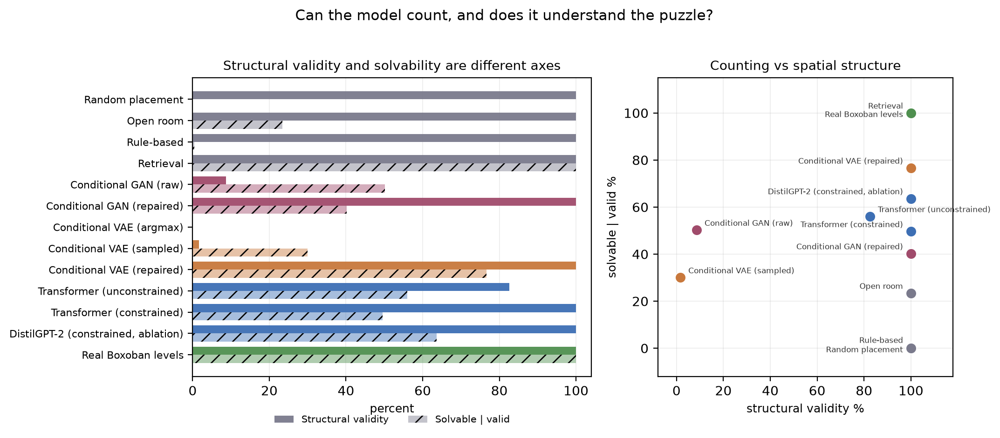
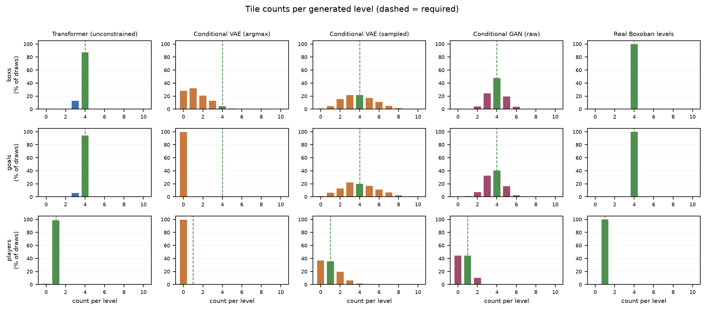

# Solver-Verified Text-Conditioned Sokoban Level Generation

Three generative model families produce 10x10 Sokoban levels from short text
captions, evaluated with an **exhaustive A\* solver** instead of a soft metric.

Because the state space of a 10x10 Sokoban level is bounded and every prune is
sound, exhausting the search is a **proof** of unsolvability. The solver is a
decision procedure, not a one-sided test, so results are reported three ways --
**solved / proven unsolvable / timed out** -- and never collapsed to two.

**Central claim:** autoregressive generation satisfies hard counting constraints
that one-shot generators cannot. A transformer emitting a level cell by cell
knows how many boxes it has already placed; a VAE or GAN decoding all 100 cells
from a latent vector does not.

This is a replication and extension of **Todd et al. 2023 (FDG), "Level
Generation Through Large Language Models"** ([lm-pcg](https://github.com/gdrtodd/lm-pcg)).
The data-scaling finding, the solvability-versus-conditioning setup and the
tokenization finding are theirs; we claim none of them.


## Main results

| Model | Struct. valid % | Solvable % | Solvable \| valid % | Timeout % | Samples drawn / 500 valid | Novel % | Novelty (NN dist) | Diversity | Params | Train time (s) |
|---|---|---|---|---|---|---|---|---|---|---|
| Random placement | 100.0 [99.3, 100.0] | 0.0 [0.0, 0.0] | 0.0 [0.0, 0.8] | 0.0 | 512 | 100.0 | 23.97 | 39.20 | -- | -- |
| Open room | 100.0 [99.3, 100.0] | 23.4 [19.7, 27.1] | 23.4 [19.9, 27.3] | 0.0 | 512 | 100.0 | 20.78 | 16.22 | -- | -- |
| Rule-based | 100.0 [99.3, 100.0] | 0.4 [0.0, 1.0] | 0.4 [0.1, 1.4] | 0.0 | 512 | 100.0 | 21.55 | 38.14 | -- | -- |
| Retrieval | 100.0 [99.3, 100.0] | 100.0 [100.0, 100.0] | 100.0 [99.2, 100.0] | 0.0 | 512 | 0.0 | 0.00 | 38.73 | -- | -- |
| Conditional GAN (raw) | 8.6 [8.0, 9.4] | 4.3 [3.8, 4.9] | 50.2 [45.8, 54.6] | 0.0 | 6,144 | 100.0 | 11.63 | 34.18 | 1,082,357 | 153 |
| Conditional GAN (repaired) | 100.0 [99.3, 100.0] | 40.2 [35.9, 44.5] | 40.2 [36.0, 44.6] | 0.0 | 512 | 100.0 | 12.60 | 36.79 | 1,082,357 | 153 |
| Conditional VAE (argmax) | 0.0 [0.0, 0.0] | -- | -- | -- | 100,000 | -- | -- | -- | 1,098,292 | 98 |
| Conditional VAE (sampled) | 1.7 [1.6, 1.9] | 0.5 [0.4, 0.6] | 30.0 [26.1, 34.2] | 0.0 | 29,184 | 100.0 | 12.84 | 38.54 | 1,098,292 | 98 |
| Conditional VAE (repaired) | 100.0 [99.3, 100.0] | 76.6 [72.9, 80.3] | 76.6 [72.7, 80.1] | 0.0 | 512 | 100.0 | 11.08 | 37.82 | 1,098,292 | 98 |
| Transformer (unconstrained) | 82.6 [80.2, 84.8] | 46.3 [42.4, 50.1] | 56.0 [51.6, 60.3] | 0.0 | 1,024 | 100.0 | 12.65 | 39.01 | 10,734,336 | 661 |
| Transformer (constrained) | 100.0 [99.3, 100.0] | 49.6 [45.2, 54.0] | 49.6 [45.2, 54.0] | 0.0 | 512 | 100.0 | 12.63 | 38.86 | 10,734,336 | 661 |
| DistilGPT-2 (constrained, ablation) | 100.0 [99.3, 100.0] | 63.6 [59.4, 67.8] | 63.6 [59.3, 67.7] | 0.0 | 512 | 100.0 | 12.18 | 38.69 | 43,352,064 | 4479 |
| Real Boxoban levels | 100.0 [99.3, 100.0] | 100.0 [100.0, 100.0] | 100.0 [99.2, 100.0] | 0.0 | 512 | 100.0 | 11.96 | 38.76 | -- | -- |

Percentages carry Wilson 95% intervals.  **Structural validity and solvability are reported separately and never merged**: `Solvable %` is of all samples drawn, `Solvable | valid %` is of structurally valid samples only.

Reference distributions on 500 held-out real levels: nearest-neighbour distance 11.92, diversity 38.81.  Novelty and diversity numbers are only interpretable against these.

Distance is cell-wise Hamming over the 100 tiles; novelty is symmetry-aware over all 8 dihedral transforms.

The intervals above capture **sampling** variation only. **Every row is a single training run.** The primary transformer configuration was additionally retrained with three seeds, giving a +/- 7.0 point spread on solvability, so differences below roughly 15 points between single-seed rows are not established. See the seed-variance section.

**Flags:**
- **Conditional VAE (argmax)**: DENOMINATOR 0 < 30: this percentage is noise, not signal



Structural validity and solvability are different axes. The one-shot families fail on the left axis (counting) while sitting at respectable values on the right axis (spatial structure), which is why the two are never merged into one number.

## Tile counts: the counting-constraint claim, directly

| Model | Boxes (mean +/- sd) | Exactly 4 boxes % | Goals (mean +/- sd) | Exactly 4 goals % | Players (mean) | Exactly 1 player % |
|---|---|---|---|---|---|---|
| Random placement | 4.00 +/- 0.00 | 100.0 | 4.00 +/- 0.00 | 100.0 | 1.00 | 100.0 |
| Open room | 4.00 +/- 0.00 | 100.0 | 4.00 +/- 0.00 | 100.0 | 1.00 | 100.0 |
| Rule-based | 4.00 +/- 0.00 | 100.0 | 4.00 +/- 0.00 | 100.0 | 1.00 | 100.0 |
| Retrieval | 4.00 +/- 0.00 | 100.0 | 4.00 +/- 0.00 | 100.0 | 1.00 | 100.0 |
| Conditional GAN (raw) | 3.93 +/- 0.89 | 48.0 | 3.72 +/- 0.94 | 40.5 | 0.68 | 44.2 |
| Conditional GAN (repaired) | 4.00 +/- 0.00 | 100.0 | 4.00 +/- 0.00 | 100.0 | 1.00 | 100.0 |
| Conditional VAE (argmax) | 1.38 +/- 1.23 | 4.7 | 0.01 +/- 0.12 | 0.0 | 0.01 | 0.5 |
| Conditional VAE (sampled) | 3.95 +/- 1.72 | 21.8 | 4.05 +/- 1.85 | 20.1 | 1.02 | 35.4 |
| Conditional VAE (repaired) | 4.00 +/- 0.00 | 100.0 | 4.00 +/- 0.00 | 100.0 | 1.00 | 100.0 |
| Transformer (unconstrained) | 3.87 +/- 0.34 | 87.1 | 3.95 +/- 0.24 | 94.1 | 1.00 | 98.6 |
| Transformer (constrained) | 4.00 +/- 0.00 | 100.0 | 4.00 +/- 0.00 | 100.0 | 1.00 | 100.0 |
| DistilGPT-2 (constrained, ablation) | 4.00 +/- 0.00 | 100.0 | 4.00 +/- 0.00 | 100.0 | 1.00 | 100.0 |
| Real Boxoban levels | 4.00 +/- 0.00 | 100.0 | 4.00 +/- 0.00 | 100.0 | 1.00 | 100.0 |

Computed over **raw draws**, valid or not: restricting to valid levels would define the counting failure away.  A valid level needs exactly one player, four boxes and four goals.



The transformer's box count is a spike at four. The VAE under argmax collapses to a near-empty room. VAE sampling recovers the right marginal rate with the wrong joint -- the right *average* number of boxes, the wrong *number per level*.

## Controllability, per attribute

| Model | Difficulty bin | Density bin | Connectivity bin | Clustering bin | Length Spearman | Length censoring % | n |
|---|---|---|---|---|---|---|---|
| Random placement | 40.0 | 50.0 | 50.0 | 49.5 | -- | 100.0 | 0 |
| Open room | 37.5 | 50.0 | 50.0 | 49.7 | 0.057 | 83.5 | 99 |
| Rule-based | 39.8 | 50.0 | 50.0 | 49.0 | -- | 99.7 | 2 |
| Retrieval | 32.7 | 49.0 | 51.5 | 51.2 | 0.021 | 0.8 | 595 |
| Conditional GAN (raw) | 53.3 | 75.6 | 64.4 | 60.0 | -0.289 (n=22, NOISE) | 51.1 | 22 |
| Conditional GAN (repaired) | 39.0 | 85.7 | 64.0 | 53.8 | 0.074 | 59.8 | 241 |
| Conditional VAE (argmax) | -- | -- | -- | -- | -- | -- | 0 |
| Conditional VAE (sampled) | 50.0 | 100.0 | 87.5 | 87.5 | 0.866 (n=3, NOISE) | 62.5 | 3 |
| Conditional VAE (repaired) | 46.2 | 88.5 | 74.2 | 82.3 | 0.389 | 27.0 | 438 |
| Transformer (unconstrained) | 41.3 | 88.3 | 84.9 | 78.6 | 0.516 | 47.8 | 249 |
| Transformer (constrained) | 43.3 | 88.8 | 80.0 | 76.3 | 0.484 | 55.2 | 269 |
| DistilGPT-2 (constrained, ablation) | 53.5 | 91.5 | 85.5 | 86.2 | 0.673 | 37.8 | 373 |
| Real Boxoban levels | 31.0 | 48.8 | 53.2 | 52.2 | -0.048 | 1.2 | 593 |

Correlations computed on fewer than 30 levels are marked NOISE inline; they are reported for completeness, not as evidence.

Wall density, connectivity and box clustering are computable directly from the grid, so a model that reproduces surface statistics will score well on them.  **Solution length is not computable without search**, so it is the only attribute that tests real understanding.

Censoring % is the fraction of suite samples with no achieved length (invalid, proven unsolvable, or timed out).  The correlation is computed on the remaining subsample, which is biased toward easy levels -- the direction that inflates it.

Achieved solution length uses the exact move-optimal solver (`cost_mode="moves"`), matching the move units used in captions.

## Out-of-distribution length requests

| Model | OOD length Spearman | OOD censoring % | Mean requested | Mean achieved | n |
|---|---|---|---|---|---|
| Random placement | -- | 100.0 | -- | -- | 0 |
| Open room | -0.047 (n=27, NOISE) | 77.5 | 116.7 | 26.9 | 27 |
| Rule-based | -- | 100.0 | -- | -- | 0 |
| Retrieval | 0.099 | 7.5 | 116.1 | 32.5 | 111 |
| Conditional GAN (raw) | -- | 77.8 | -- | -- | 2 |
| Conditional GAN (repaired) | -0.131 | 62.5 | 117.1 | 24.9 | 45 |
| Conditional VAE (argmax) | -- | -- | -- | -- | 0 |
| Conditional VAE (sampled) | -- | 66.7 | -- | -- | 1 |
| Conditional VAE (repaired) | -0.059 | 55.0 | 117.8 | 42.3 | 54 |
| Transformer (unconstrained) | 0.394 (n=13, NOISE) | 63.9 | 96.2 | 37.7 | 13 |
| Transformer (constrained) | -0.394 | 60.0 | 115.8 | 29.5 | 48 |
| DistilGPT-2 (constrained, ablation) | -0.274 | 51.7 | 120.0 | 30.4 | 58 |
| Real Boxoban levels | 0.131 | 0.8 | 116.9 | 30.3 | 119 |

Out-of-distribution requests ask for solution lengths of 90, 110 and 150 moves.  Measured on the training split: p90 = 47, p99 = 67, p99.9 = 87, maximum = 130.  Failure to extrapolate is the expected result and populates the Failure Analysis section.

## Temperature sweep

| Temperature | Solvable \| valid % | Diversity | Novel % |
|---|---|---|---|
| 0.6 | 61.2 [56.9, 65.4] | 35.82 | 100.0 |
| 0.8 | 53.8 [49.4, 58.1] | 37.34 | 100.0 |
| 1.0 | 51.4 [47.0, 55.8] | 38.86 | 100.0 |
| 1.2 | 41.4 [37.2, 45.8] | 39.00 | 100.0 |
| 1.5 | 34.8 [30.8, 39.1] | 38.03 | 100.0 |

## Pairwise significance

| Comparison (solvable \| valid) | Difference (pp) | z | p |
|---|---|---|---|
| Transformer (constrained) vs Open room | +26.2 | 8.60 | 0.00e+00 |
| Transformer (constrained) vs Rule-based | +49.2 | 17.97 | 0.00e+00 |
| Transformer (constrained) vs Transformer (unconstrained) | -6.4 | -2.03 | 4.27e-02 |
| Transformer (unconstrained) vs Conditional VAE (sampled) | +26.0 | 8.30 | 0.00e+00 |
| Transformer (constrained) vs Real Boxoban levels | -50.4 | -18.35 | 0.00e+00 |

## Seed variance, and what it licenses

The primary transformer configuration was trained **three times**, changing only
the seed, then sampled and solved identically. Every other row in this
repository is a single run.

| Metric | Mean +/- sd | Per-seed |
|---|---|---|
| Structural validity % | 100.0 +/- 0.0 | 100.0, 100.0, 100.0 |
| Solvable \| valid % | 42.7 +/- 7.0 | 46.6, 34.6, 47.0 |
| Diversity | 38.59 +/- 0.31 | 38.92, 38.30, 38.57 |
| Validation loss | 0.3565 +/- 0.0049 | 0.3546, 0.3621, 0.3529 |

Structural validity is perfectly stable, because constrained decoding guarantees
it. Solvability is **not**: it moves by +/- 7.0 points across seeds while
validation loss moves by only +/- 0.0049, so **validation loss is a poor
proxy for the property actually being evaluated**.

That spread bounds what the main table can support. The gap over the baselines
survives easily (even the worst seed beats open room by a wide margin), but no
difference smaller than roughly 15 points between two single-seed rows should be
read as established -- including our own DistilGPT-2 ablation.


## Solver validation (GATE 2)

The solver is the ground truth for every number here, so it is validated before
anything else is believed.

| Check | Result |
|---|---|
| Solve rate, 1,000 real held-out test levels | **100.00%** |
| False "unsolvable" verdicts on real levels | **0** |
| Returned solutions that replay to a solved state | **1000/1000** |
| Soundness ablation (pruning off, 10x node cap) | **0** disagreements |
| Same ablation on 3 baseline distributions (450 levels) | **0** disagreements |
| Median / p99 nodes expanded | 176 / 3,458 |
| Median / p99 wall time | 66 ms / 1.4 s |

Solve rate reaches 100% at a node cap of 10,000 and stays flat to 1,000,000, so
the headline numbers are converged rather than budget-limited.

**Move length is an upper bound.** Push-optimal search discards the player's
exact cell, so the move length reconstructed by walking the player between
pushes overshoots move-optimal by **+40.5% on average** (exactly optimal on only
6.6% of levels, zero bound violations). Controllability therefore measures
achieved length with the *exact* move-optimal solver, matching the move units
used in captions.


## Data findings worth knowing

Phase 1 verified every format assumption instead of trusting it. Three findings
affect anyone else using this data:

1. **`Steps` counts player moves, not pushes.** The action string is digits 0-3
   = Up, Right, Down, Left, and `Steps == len(Actions)`. Their A\* minimised
   moves, so `Steps` is move-optimal where valid.
2. **Some published solutions are silently wrong.** Beyond the rows marked
   `SEARCH_STATE_FAILED`/`NOT_FOUND`, we found rows that *look* well-formed but
   **do not replay to a solved state**: 63/1000 (6.3%) of `unfiltered_test` and
   ~0.7% of `unfiltered_train`. No direction convention, transposition, or
   no-op-on-block semantics rescues them. **Every solution used here is
   replay-validated** and failures are dropped.
3. **Neither `*` nor `+` occurs anywhere in the corpus**, so a box never starts
   on a goal. That is what makes the 5-channel one-hot tensor, the 6-symbol grid
   vocabulary, and the "exactly four `$` and four `.`" constraint all
   well-defined.

Also: files are CRLF, and **every Boxoban level has exactly one connected floor
component** -- so "number of floor components" is a constant and useless as a
caption feature. We use mean floor degree (corridor width) instead.


## Reproduction

```bash
pip install -r requirements.txt
git clone https://github.com/google-deepmind/boxoban-levels data_raw/boxoban-levels
python -c "from huggingface_hub import snapshot_download; snapshot_download('AlignmentResearch/boxoban-astar-solutions', repo_type='dataset', local_dir='data_raw/astar-solutions')"

python scripts/00_verify_data.py       # GATE 1: verify every data assumption
python scripts/01_build_dataset.py     # GATE 3: captions and datasets
python scripts/02_validate_solver.py   # GATE 2: solver validation + soundness ablation
python scripts/03_train.py --model transformer
python scripts/03_train.py --model vae
python scripts/03_train.py --model gan
python scripts/03_train.py --model distilgpt2   # pretraining ablation
python scripts/04_generate.py          # GPU sampling
python scripts/05_evaluate.py          # CPU solver sweep -> tables + figures
```

Seed 1337 throughout; every script takes `--seed`. Every result JSON embeds its
config, seed and git SHA, and every table is regenerated from those artifacts.

> **Do not run `05_evaluate.py` while a GPU job is active.** The GPU heats the
> package, CPU cores throttle, and solver throughput silently halves mid-sweep,
> corrupting the timing measurements.

## Tests

```bash
python -m pytest tests/
```

The solver tests were written before the solver. They include ~11 hand-built
fixtures with known verdicts, exact push-optimal lengths, differential testing
against an independently written reference solver that shares no code or
representation, and a check that every "solved" verdict comes with an action
string that replays to a solved state.

## Layout

```
sokogen/
  data/      Boxoban parsing, replay-validated solutions, captions, vocabulary
  solver/    bitmask grids, sound deadlock detection, exhaustive A*
  models/    from-scratch transformer, conditional VAE, conditional GAN
  decoding/  constrained decoding (grid guard), repair
  baselines/ random, open room, rule-based, retrieval
  eval/      metrics, harness, tables, figures
scripts/     00..05, the full pipeline in order
results/     JSON artifacts, generated levels with solver verdicts, tables
paper/       IEEE two-column source
```

## Citation

If you use the solver or the replay-validation finding, please also cite the
upstream sources:

- Guez et al. 2018, *Boxoban levels* (the corpus)
- Garriga-Alonso, Taufeeque & Gleave, ICML 2024 MI Workshop (the A\* solutions)
- Todd et al. 2023, FDG (the work this replicates and extends)

